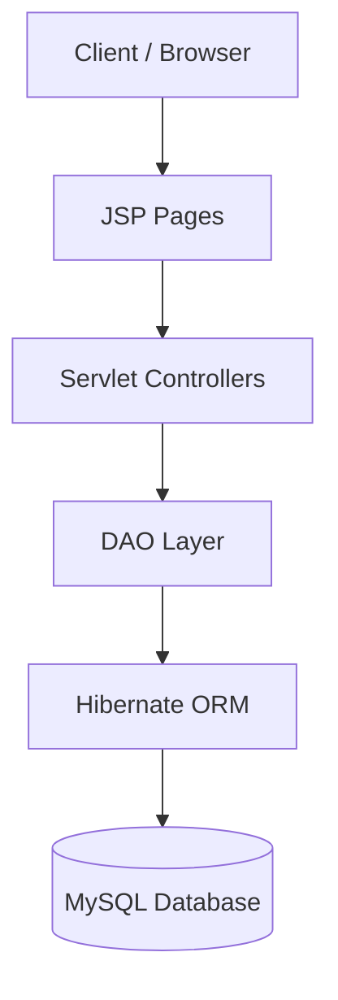
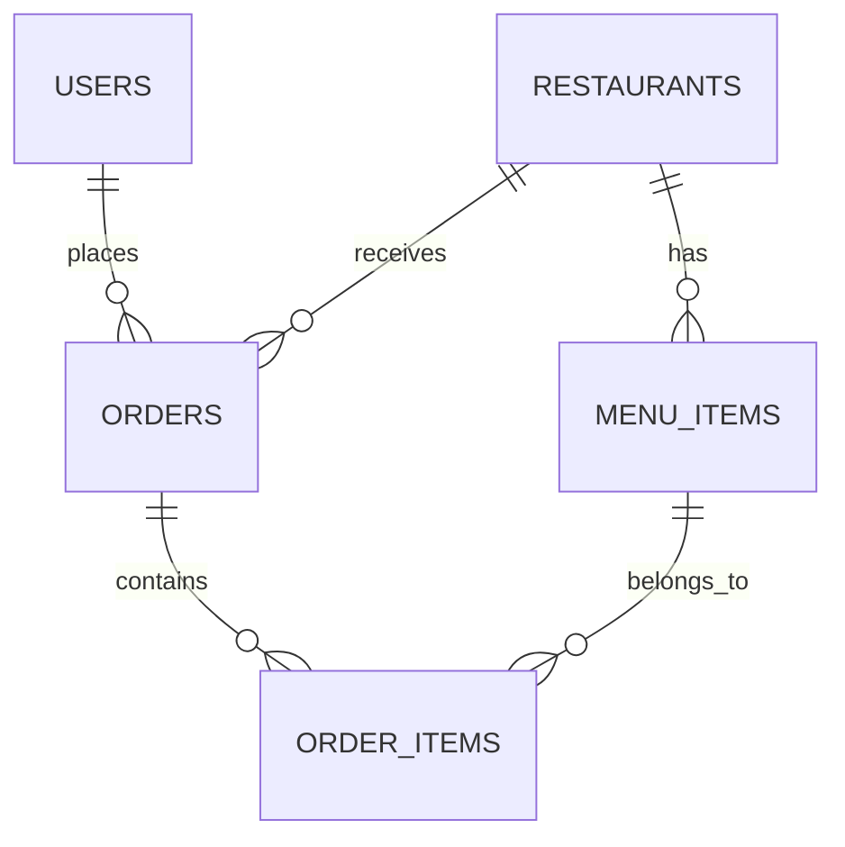
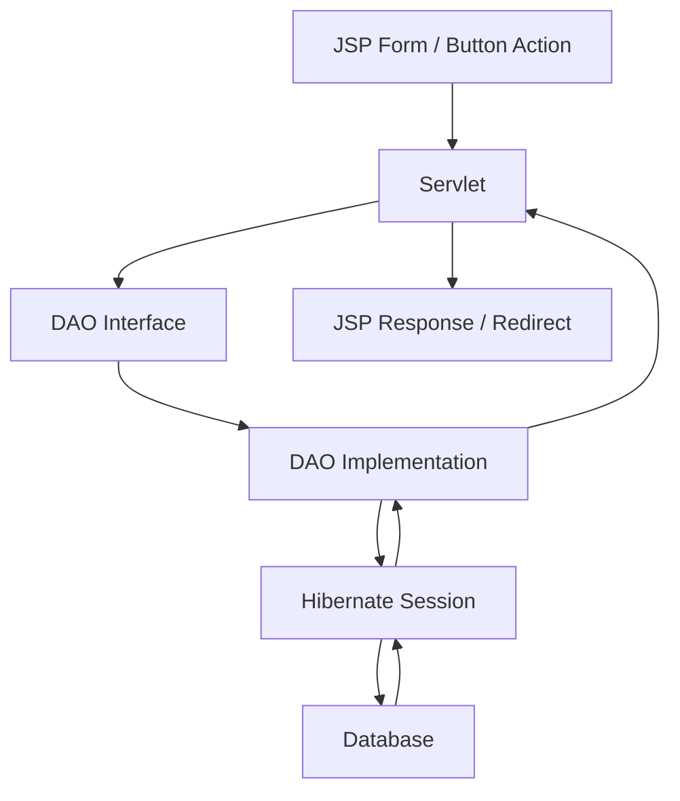

# 🍽️ Cravix — Full Stack Food Delivery Web Application

Cravix is a **Java Full Stack food delivery web application** inspired by platforms like Swiggy and Zomato.  
It provides a complete food-ordering workflow where users can register, log in, browse restaurants, explore menus, add items to cart, place orders, manage their profile, and review past orders — all through a clean and modern UI.

> Built using **Java, JSP, Servlets, Hibernate, MySQL, Maven, HTML, CSS, and JavaScript**.

---

## 📌 Table of Contents
- [Overview](#-overview)
- [Live Features](#-live-features)
- [Screenshots to Add](#-screenshots-to-add)
- [Tech Stack](#-tech-stack)
- [Architecture](#-architecture)
- [Project Structure](#-project-structure)
- [Database Design](#-database-design)
- [Application Flow](#-application-flow)
- [Servlet / Route Mapping](#-servlet--route-mapping)
- [Setup & Installation](#-setup--installation)
- [How to Use](#-how-to-use)
- [Sample Demo Flow](#-sample-demo-flow)
- [What I Learned](#-what-i-learned)
- [Future Enhancements](#-future-enhancements)
- [Author](#-author)

---

# 🌟 Overview

Cravix was built as a **portfolio-ready food delivery project** to demonstrate practical backend and frontend development skills in the Java ecosystem.

The project focuses on:
- **Servlet-based MVC flow**
- **Hibernate ORM integration**
- **DAO design pattern**
- **Session-based authentication**
- **Dynamic JSP rendering**
- **Cart, checkout, and order management**
- **Responsive and polished UI design**

It is a strong practice project for:
- **Java Full Stack Developer roles**
- **Servlet/JSP/Hibernate interview discussions**
- **College project / portfolio showcase**
- **Backend architecture and CRUD flow demonstrations**

---

# ✨ Live Features

## 👤 User Module
- User registration
- User login
- Session-based authentication
- Logout functionality
- Profile page with editable user details

## 🍴 Restaurant Module
- Homepage with restaurant listings
- Search restaurants by name/cuisine
- Restaurant detail page
- Restaurant-wise menu loading
- Ratings, address, cuisine display

## 📋 Menu Module
- Category-wise menu items
- Dish name, description, price, image
- Availability support
- Menu cards styled for better browsing

## 🛒 Cart Module
- Add items to cart
- Increase / decrease quantity
- Remove items from cart
- Cart total calculation
- Session-based cart management

## 💳 Checkout Module
- Delivery address collection
- Payment mode selection
- Order summary
- Place order flow
- Order success page

## 📦 Order Module
- Persist orders in database
- Save order items
- View order history
- Show ordered items under each order
- Track order status and details

## 🎨 UI / UX Improvements
- Consistent Cravix branding
- Reusable logo/navbar structure across pages
- Improved profile integration
- Better cart/checkout/order pages
- Search suggestions on home page
- Realistic restaurant + menu dataset support

---

# 🖼️ Screenshots to Add

> Add these screenshots in your GitHub repo later for a stronger presentation.

Suggested screenshots:
1. **Login Page**
2. **Register Page**
3. **Home Page**
4. **Restaurant Page**
5. **Cart Page**
6. **Checkout Page**
7. **Order Success Page**
8. **Order History Page**
9. **Profile Page**

Example markdown format once you upload images:

```md
## Home Page


## Restaurant Page

```

---

# 🛠️ Tech Stack

| Category | Technologies |
|---------|--------------|
| Language | Java |
| Backend | JSP, Servlets |
| ORM | Hibernate |
| Database | MySQL |
| Build Tool | Maven |
| Frontend | HTML, CSS, JavaScript |
| Server | Apache Tomcat 10 |
| IDE | Eclipse / IntelliJ IDEA |
| Architecture Style | Servlet + DAO + Hibernate + JSP MVC |

---

# 🧱 Architecture

Cravix follows a layered architecture:

- **JSP pages** for UI rendering
- **Servlets** for request handling and navigation
- **DAO interfaces + implementations** for database operations
- **Hibernate ORM** for persistence and entity management
- **MySQL** as the relational database

## Architecture Diagram



---

# 🗂️ Project Structure

```text
Cravix/
├── pom.xml
├── README.md
├── src/
│   └── main/
│       ├── java/
│       │   └── com/cravix/
│       │       ├── controller/      # All servlet controllers
│       │       ├── dao/             # DAO interfaces
│       │       ├── daoimpl/         # DAO implementations
│       │       ├── model/           # Entity / model classes
│       │       └── util/            # Hibernate utility / config helpers
│       │
│       ├── resources/
│       │   └── hibernate.cfg.xml
│       │
│       └── webapp/
│           ├── login.jsp
│           ├── register.jsp
│           ├── home.jsp
│           ├── restaurant.jsp
│           ├── cart.jsp
│           ├── checkout.jsp
│           ├── order-success.jsp
│           ├── order-history.jsp
│           ├── profile.jsp
│           └── images/
│               └── cravix-logo.png
```

---

# 🗃️ Database Design

## Main Tables
Cravix uses the following main tables:

### 1. `users`
Stores registered user information.
- user_id
- full_name
- email
- phone
- password
- address
- role
- created_at

### 2. `restaurants`
Stores restaurant details.
- restaurant_id
- name
- cuisine_type
- address
- rating
- image_path
- is_active

### 3. `menu_items`
Stores restaurant menu items.
- menu_id
- restaurant_id
- item_name
- description
- price
- category
- is_available
- image_path

### 4. `orders`
Stores order-level information.
- order_id
- user_id
- restaurant_id
- total_amount
- status
- delivery_address
- payment_mode
- order_date

### 5. `order_items`
Stores each item inside an order.
- order_item_id
- order_id
- menu_id
- quantity
- price

---

## Entity Relationship Diagram



---

# 🔄 Application Flow

## User Journey


## Internal Backend Flow


---

# 🧭 Servlet / Route Mapping

Below is a clean route overview for the project.

| Route / URL | Servlet / Page | Purpose |
|------------|----------------|---------|
| `/login` | LoginServlet | Authenticates user |
| `/register` | RegisterServlet | Registers new user |
| `/logout` | LogoutServlet | Logs out current user |
| `/home` | HomeServlet | Loads homepage and restaurant search |
| `/restaurant` | RestaurantServlet | Loads selected restaurant + menu |
| `/cart` | CartServlet | Shows cart, update quantity, remove items |
| `/checkout` | CheckoutServlet | Checkout flow and order creation |
| `/profile` | ProfileServlet | Loads and updates profile |
| `/order-history` | OrderHistoryServlet | Shows user’s past orders |

> If your servlet names differ slightly in code, update this table accordingly before pushing.

---

# ⚙️ Setup & Installation

## 1) Clone the Repository
```bash
git clone https://github.com/Naveenexe/Cravix-food-delivery-application.git
cd Cravix-food-delivery-application
```

## 2) Open the Project
Import the project as a **Maven Project** in:
- **Eclipse**
- **IntelliJ IDEA**

---

## 3) Create the Database
Open MySQL and run:

```sql
CREATE DATABASE cravix;
```

---

## 4) Configure Hibernate
Open `hibernate.cfg.xml` and update your DB credentials.

Example:

```xml
<property name="hibernate.connection.url">jdbc:mysql://localhost:3306/cravix</property>
<property name="hibernate.connection.username">root</property>
<property name="hibernate.connection.password">your_password</property>
<property name="hibernate.dialect">org.hibernate.dialect.MySQLDialect</property>
```

---

## 5) Create Tables / Run SQL
Create the required tables:
- `users`
- `restaurants`
- `menu_items`
- `orders`
- `order_items`

Then insert your sample restaurant/menu dataset.

---

## 6) Build the Project
Run:

```bash
mvn clean install
```

---

## 7) Configure Apache Tomcat
- Install / configure **Apache Tomcat 10**
- Add the Cravix project to the server
- Run the application

Then open:

```text
http://localhost:8080/Cravix/
```

---

# 🚀 How to Use

## Step 1: Register
Create a new account from the register page.

## Step 2: Login
Login using your registered credentials.

## Step 3: Browse Restaurants
On the home page:
- search restaurants
- click a restaurant card
- view available menu items

## Step 4: Add Items to Cart
Select dishes and add them to cart.

## Step 5: Manage Cart
From the cart page:
- update quantity
- remove unwanted items
- verify total amount

## Step 6: Checkout
Enter:
- delivery address
- payment mode

Then place the order.

## Step 7: View Order Success & History
After successful order placement:
- open order success page
- go to order history to view previous orders

## Step 8: Update Profile
Open the profile page and update personal details if needed.

---

# 🎯 Sample Demo Flow

If you’re presenting the project to someone, this is a clean demo flow:

1. Register a new account  
2. Login  
3. Search for a restaurant on the home page  
4. Open restaurant page  
5. Add 2–3 menu items to cart  
6. Open cart and update quantity  
7. Proceed to checkout  
8. Place order  
9. Show order success page  
10. Open order history  
11. Open profile page and update details  

This demonstrates:
- authentication
- CRUD-like data flow
- session handling
- order persistence
- UI navigation
- profile editing

---

# 📚 What I Learned

Building Cravix helped strengthen practical understanding of:

## Backend / Java Concepts
- Java servlet lifecycle
- Request forwarding vs redirecting
- Session management in web applications
- Layered architecture using DAO pattern
- CRUD operations with Hibernate
- Handling entity relationships in ORM
- Working with JSP and dynamic data rendering
- Building end-to-end order flow logic

## Database / ORM Concepts
- Designing relational table structure
- Mapping entities with Hibernate
- Handling one-to-many relationships
- Saving order + order items correctly
- Managing foreign key dependencies during cleanup/reset

## Frontend / UI Concepts
- Creating responsive JSP layouts
- Reusing a consistent design system
- Improving navigation and page hierarchy
- Search UI enhancement
- Structuring pages for a more app-like experience

## Debugging / Real Project Lessons
- Fixing Hibernate lazy loading issues
- Handling broken image/data issues
- Maintaining consistency between backend data and UI
- Iteratively refining pages without breaking flow
- Thinking about final demo quality, not just raw functionality

---

# 🔮 Future Enhancements

Possible improvements for Cravix:

- **Admin dashboard** to manage restaurants and menus
- **Live order tracking**
- **Coupon and discount system**
- **Online payment gateway integration**
- **Reviews and ratings by users**
- **Wishlist / favorites**
- **Restaurant-side dashboard**
- **Email confirmation after order placement**
- **Pagination / advanced filtering**
- **Cloud deployment**

---

# 👨‍💻 Author

**Naveen Watare**  
Java Full Stack Developer

- GitHub: [Naveenexe](https://github.com/Naveenexe)

---

# 📄 License

This project is built for:
- learning
- practice
- portfolio showcase
- project demonstration

You may use it for educational reference and inspiration.
